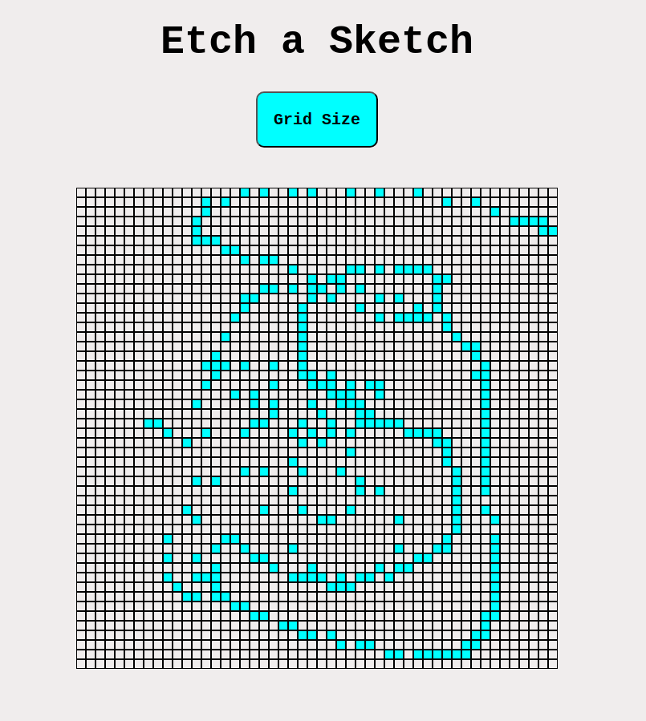
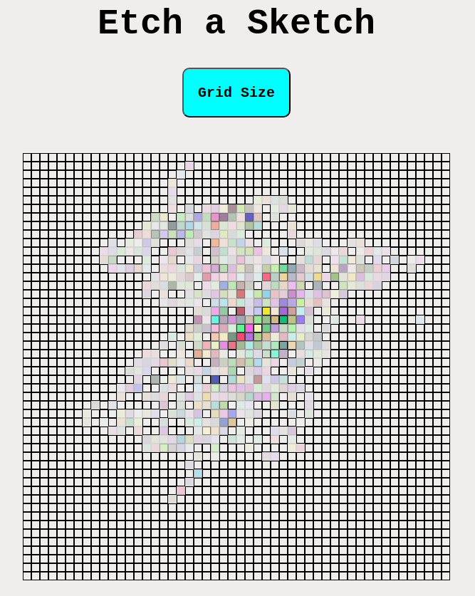

# Etch a Sketch

Created a web etch a sketch that generates a grid when you press the "Grid size" button.
The user needs to input a value between 0 and 100 otherwise the prompt keeps asking the user
for the size.

After the grid is generated the user can mouseover the boxes in the grid to color them in.
If the user wants to remove the color from a box, he has to click on the box.

Example of a 50x50 grid (V1 -> no color or opacity):

Example of a 50x50 grid (V2 -> color and opacity)

